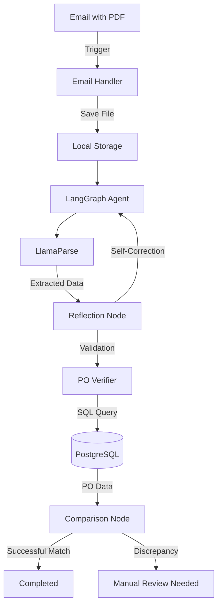

# 🤖 InvoSync: AI-Powered Invoice Matching Agent

An intelligent agentic pipeline for matching purchase order invoices with database records using LangGraph, LlamaParse, and PostgreSQL.

## 🚀 Overview

InvoSync automates the tedious task of matching incoming invoices with existing Purchase Orders (POs). It features an "Agentic Reflection" loop that cross-checks its own data extraction for high accuracy.

### Key Features
- **📩 Real-time Email Trigger**: Automatically downloads invoices from emails.
- **🧠 Agentic Pipeline**: Built with LangGraph for robust multi-step reasoning.
- **🔍 Reflection Loop**: The agent "thinks" about its extraction and corrects errors (e.g., math discrepancies).
- **🗄️ Database Integration**: Professional PostgreSQL support for PO data.
- **📊 Professional Dashboard**: Streamlit-based UI for monitoring and manual uploads.

## 🏗️ Architecture



## 🛠️ Setup

1. **Environment**:
   ```bash
   python -m venv venv
   .\venv\Scripts\activate
   pip install -r requirements.txt
   ```

2. **Database**:
   Configure `.env` with your PostgreSQL credentials, then:
   ```bash
   python database.py --init
   ```

3. **Run**:
   - **Streamlit Dashboard**: `python main.py ui`
   - **Real-time Email Listener**: `python main.py email`
   - **Local Folder Watcher**: `python main.py watcher` (Monitors `invoices_temp` for new files)
   - **Direct Processing**: `python main.py process --file "path/to/invoice.pdf"`

### 📧 Gmail API Setup (OAuth2)
To use the automated email listener (`python main.py gmail`):
1.  Go to the [Google Cloud Console](https://console.cloud.google.com/).
2.  Create a new project.
3.  Enable the **Gmail API** in "APIs & Services" > "Library".
4.  Go to "APIs & Services" > "OAuth consent screen", set "User Type" to **External**, and add your email as a **Test User**.
5.  Go to "APIs & Services" > "Credentials", click **Create Credentials** > **OAuth client ID**.
6.  Select **Desktop App**, name it, and click **Create**.
7.  Download the JSON file, rename it to `credentials.json`, and place it in the project root.
8.  Run `python main.py gmail`. A tab will open in your browser to authorize the app.

## 👨‍💻 Tech Stack
- **AI**: LangChain, LangGraph, Groq (Llama-3.3-70B)
- **Document Analysis**: LlamaParse
- **Database**: PostgreSQL (SQLAlchemy)
- **UI**: Streamlit
- **Automation**: imap_tools

---
*Developed for professional AI agent demonstrations.*
